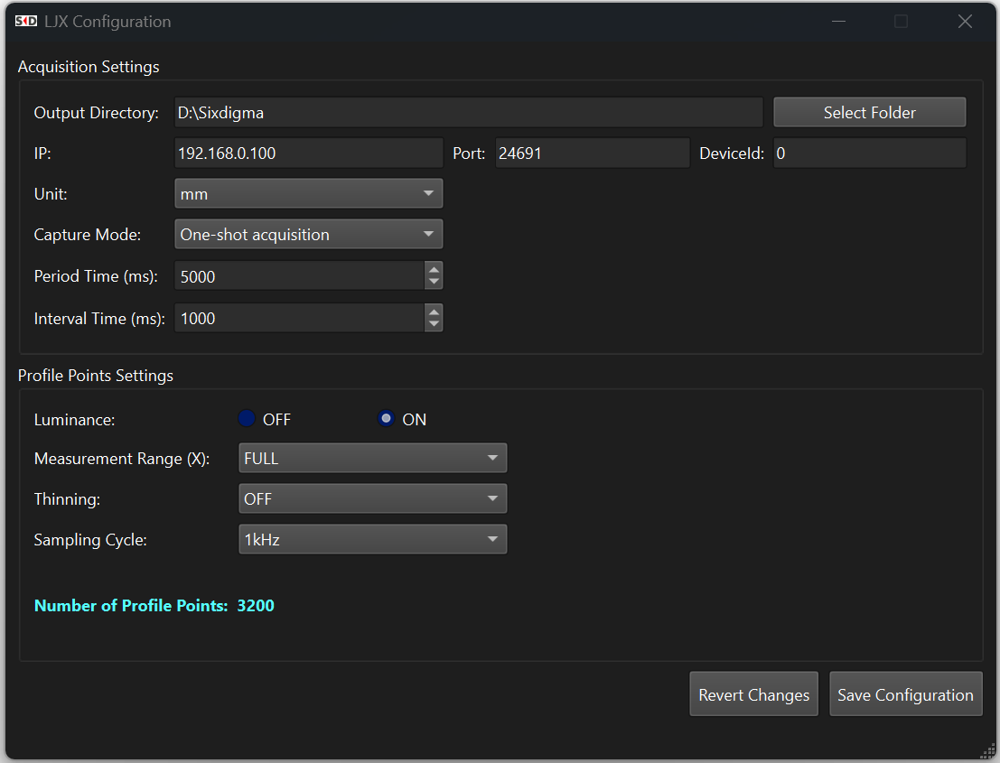
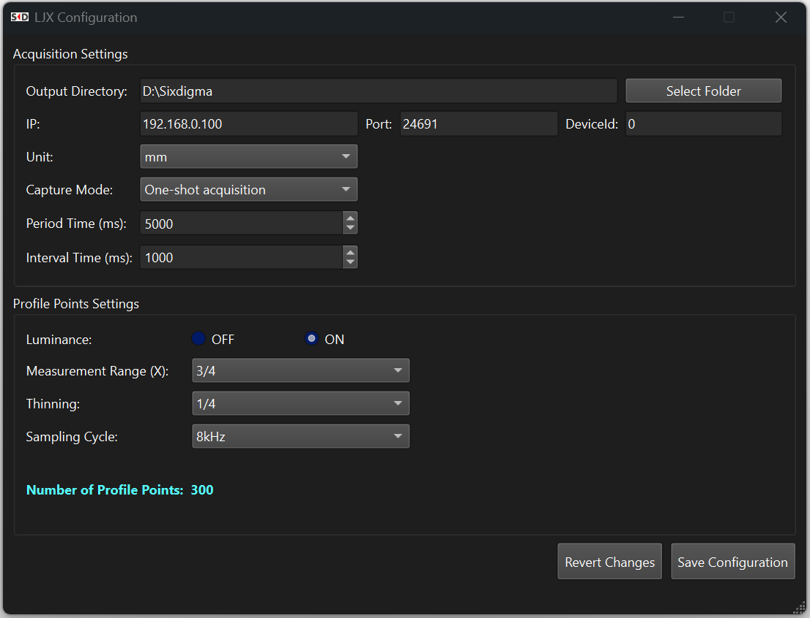

# LJ-X Controller

Windows C++/Qt applications for acquiring profile data from a KEYENCE LJ-X controller over Ethernet and exporting the acquired height and luminance values to files.

The project contains two applications:

- **LJXController** — a headless acquisition application that reads its settings from `config/configuration.json`, performs the requested acquisition, saves the results, and exits automatically.
- **LJXConfiguration** — a small graphical tool for editing the configuration file and calculating the expected number of points per profile.

## Features

- Ethernet communication with the LJ-X controller through the KEYENCE `LJX8_IF` API
- One-shot and timed profile acquisition
- Height-data export
- Optional luminance-data export
- Configurable output unit: millimetres or inches
- Configurable measurement range, X-axis thinning, and sampling cycle
- Automatic calculation of the expected number of profile points
- JSON-based configuration
- Daily operation logs
- Single-instance protection to prevent simultaneous controller access

## Important hardware configuration

The application does **not** change the LJ-X controller settings automatically.

The following settings selected in `LJXConfiguration` must also be applied directly to the LJ-X controller:

- Luminance output
- Measurement Range (X)
- Thinning (X)
- Sampling Cycle

The controller and application settings must match. A mismatch can produce an incorrect expected profile size or cause profile acquisition to fail.

## Profile point calculation

The LJ-X uses 3,200 points as the base profile size in standard mode:

```text
Number of points =
3,200 × Measurement Range factor × Thinning factor × Sampling/Binning factor
```

| Setting | Available values |
| --- | --- |
| Measurement Range (X) | `FULL`, `3/4`, `1/2`, `1/4` |
| Thinning (X) | `OFF`, `1/2`, `1/4` |
| Sampling Cycle | `10` Hz through `16000` Hz using the supported LJ-X steps |

The sampling/binning factor is either `1.0` or `0.5`, depending on the selected sampling cycle and luminance-output setting. The configuration tool calculates the expected result automatically.

For example:

```text
Measurement Range (X): 3/4
Thinning (X):           1/2
Sampling factor:        0.5

3,200 × 0.75 × 0.5 × 0.5 = 600 points per profile
```

## Configuration

Both applications use:

```text
config/configuration.json
```

The path is resolved relative to the executable directory. It is recommended to edit this file through `LJXConfiguration.exe`.

Example:

```json
{
    "OutputDirectory": "C:/LJXOutput",
    "IP": "192.168.0.100",
    "Port": 24691,
    "DeviceId": 0,
    "Unit": "mm",
    "Luminance": true,
    "CaptureMode": "single",
    "PeriodTime": 5000,
    "IntervalTime": 1000,
    "MeasuringRangeX": "FULL",
    "Thinning": "OFF",
    "SamplingCycle": 1000
}
```
## Configuration Tool

The configuration tool allows users to edit the acquisition settings and immediately calculate the expected number of points per profile.

<p align="center">
  

  
</p>

### Configuration fields

| Field | Description | Supported values or unit |
| --- | --- | --- |
| `OutputDirectory` | Directory in which acquired data is saved | Valid Windows directory |
| `IP` | LJ-X controller IP address | IPv4 address |
| `Port` | Ethernet communication port | Default: `24691` |
| `DeviceId` | Device identifier passed to the KEYENCE API | Usually `0` |
| `Unit` | Output measurement unit | `mm` or `inch` |
| `Luminance` | Enables luminance-data handling | `true` or `false` |
| `CaptureMode` | Acquisition mode | `single` or `loop` |
| `PeriodTime` | Total duration of timed acquisition | Milliseconds |
| `IntervalTime` | Delay between acquisitions in timed mode | Milliseconds |
| `MeasuringRangeX` | X-axis measurement range | `FULL`, `3/4`, `1/2`, or `1/4` |
| `Thinning` | X-axis sub-sampling factor | `OFF`, `1/2`, or `1/4` |
| `SamplingCycle` | LJ-X sampling frequency | Numeric value in Hz |

Supported `SamplingCycle` values:

```text
10, 20, 50, 100, 200, 500,
1000, 1500, 2000, 2500, 3000, 3500, 4000, 4500,
5000, 6000, 7000, 8000, 10000, 12000, 14000, 16000
```

## Acquisition modes

### One-shot acquisition

Set:

```json
"CaptureMode": "single"
```

`LJXController.exe` acquires one profile, saves the output files, and exits.

### Timed acquisition

Set:

```json
"CaptureMode": "loop",
"PeriodTime": 5000,
"IntervalTime": 1000
```

The application acquires profiles at the configured interval for the configured total period, saves all profiles, and exits.

## Output files

The application writes the following files to `OutputDirectory`:

- `Height.csv` — acquired height values
- `Luminance.csv` — acquired luminance values when luminance output is enabled

The files are written as tab-separated UTF-16 LE text with a byte-order mark. Each acquired profile is stored on a separate line.

Operation logs are written to:

```text
log/LJX_Logger.txt
```

The log directory is relative to the process working directory.

## System requirements

- Windows 64-bit
- KEYENCE LJ-X controller and compatible LJ-X head
- Ethernet connection to the controller
- CMake 3.16 or later
- C++17-compatible compiler
- Qt 6.8 or later
- KEYENCE LJ-X communication runtime (`LJX8_IF.dll`)

Recommended and tested development configuration:

- Visual Studio 2022 with the **Desktop development with C++** workload
- Qt 6.11.1, **MSVC 2022 64-bit**

> `LJXConfiguration/main.cpp` currently uses `QStyleHints::setColorScheme()`, which was introduced in Qt 6.8. Building with Qt 6.7.3 requires removing that call or protecting it with a Qt-version check.

## Building from source

Clone the repository:

```powershell
git clone https://github.com/MahmoudWali/LJXController.git
cd LJXController
```

Configure and build with Visual Studio 2022 and Qt 6.11.1:

```powershell
cmake -S . -B build `
  -G "Visual Studio 17 2022" `
  -A x64 `
  -DCMAKE_PREFIX_PATH="C:/Qt/6.11.1/msvc2022_64"

cmake --build build --config Release
```

The executables are normally generated under:

```text
build/Release/
```

The build creates:

```text
LJXController.exe
LJXConfiguration.exe
```

### Runtime deployment

Deploy the required Qt libraries:

```powershell
C:\Qt\6.11.1\msvc2022_64\bin\windeployqt.exe build\Release\LJXController.exe
C:\Qt\6.11.1\msvc2022_64\bin\windeployqt.exe build\Release\LJXConfiguration.exe
```

Copy the KEYENCE `LJX8_IF.dll` runtime library into the same directory as the executables. The CMake build copies the files from the repository's `config` directory into the build output automatically.

## Running the applications

1. Connect the PC and LJ-X controller over Ethernet.
2. Configure the LJ-X hardware using the KEYENCE controller software.
3. Run `LJXConfiguration.exe`.
4. Enter the connection and acquisition settings.
5. Ensure the luminance, measurement-range, thinning, and sampling-cycle settings match the controller.
6. Save the configuration.
7. Run `LJXController.exe`.
8. Check the configured output directory for `Height.csv` and, when enabled, `Luminance.csv`.

Only one instance of `LJXController.exe` can run at a time.

## Prebuilt release

A prebuilt Windows release is available for testing:

[Download LJX Controller v2.0.0](https://github.com/MahmoudWali/LJXController/releases/download/v2.0.0/LJXApp.7z)

## Project structure

```text
LJXController/
├── CMakeLists.txt
├── main.cpp
├── controller.cpp
├── controller.h
├── logger.cpp
├── logger.h
├── config/
│   └── configuration.json
├── LJXConfiguration/
│   ├── CMakeLists.txt
│   ├── main.cpp
│   ├── mainwindow.cpp
│   ├── mainwindow.h
│   └── mainwindow.ui
├── LJXLib/
└── spdlog/
```

## Troubleshooting

### Qt cannot be found by CMake

Pass the Qt installation path through `CMAKE_PREFIX_PATH`, as shown in the build command. Alternatively, define `QTDIR`:

```text
QTDIR=C:\Qt\6.11.1\msvc2022_64
```

### `LJX8_IF.dll` is missing

Copy the KEYENCE runtime DLL into the executable directory.

### The returned number of points is incorrect

Verify that the following application settings exactly match the active LJ-X controller configuration:

- Luminance
- Measurement Range (X)
- Thinning (X)
- Sampling Cycle

### The controller cannot be reached

Check the controller IP address, port, Ethernet connection, Windows firewall settings, and the selected `DeviceId`.

## Third-party components

- [Qt](https://www.qt.io/)
- [spdlog](https://github.com/gabime/spdlog)
- KEYENCE LJ-X communication library

KEYENCE and LJ-X are trademarks of KEYENCE Corporation. The KEYENCE SDK and runtime files are subject to their respective vendor terms.
